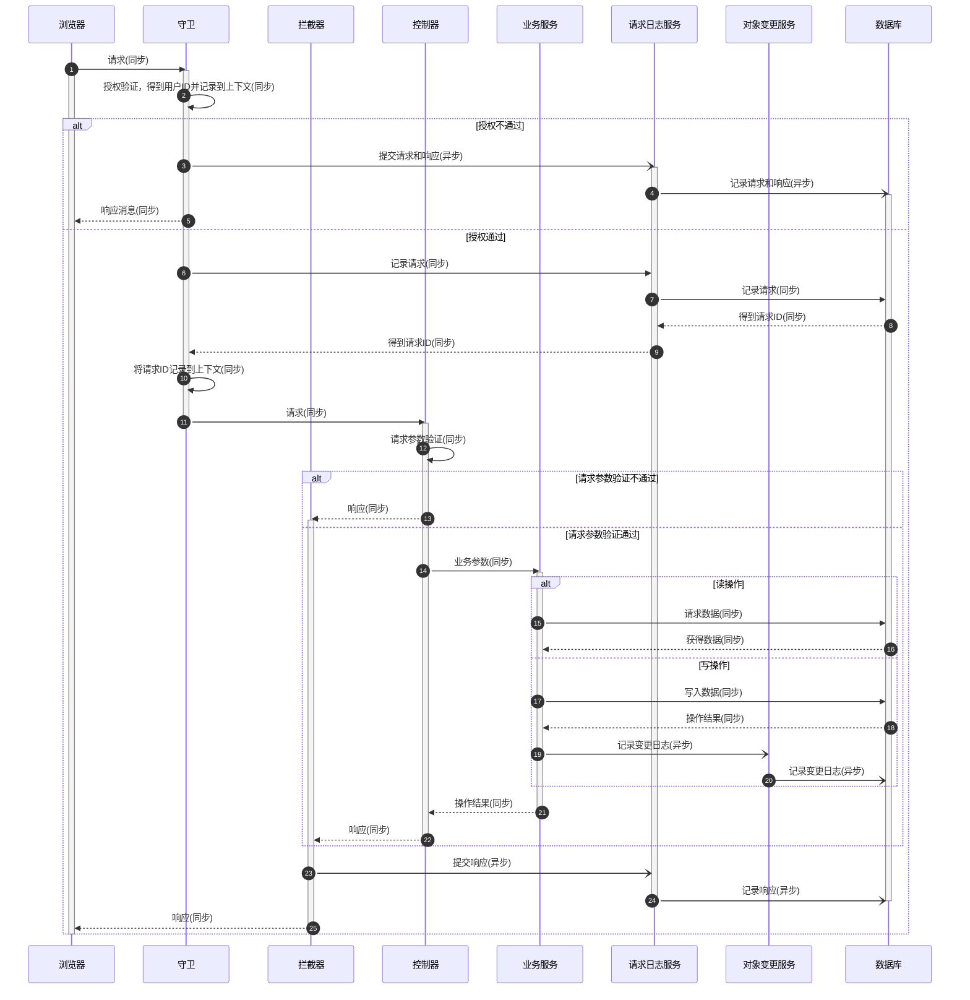

# 技术方案

## 使用框架

NestJS

## 数据库

Postgres

## 缓存

Redis

## 使用到的框架功能

- 守卫
- 拦截器
- 自定义装饰器
- 配置
- 控制器
- 服务
- 网关
- 队列
- TypeOrm
- 事件

# 同步与异步

## 同步处理

- 按需验证请求消息头中的令牌，如果验证不通过则抛出异常
  - 跟身份认证相关的操作在守卫中处理
- 根据请求路由验证令牌的有效性，如果验证不通过则抛出异常
  - 授权参数在控制器中配置
- 验证请求提交数据的有效性，如果验证不通过则抛出异常
  - 定义 DTO 对象，验证提交数据
- 处理提交数据，并确定处理结果
  - 在服务中处理提交数据
- 返回响应消息

## 异步处理

- 在处理数据过程中，按需触发事件或队列，记录操作日志和实体对象变更日志

## 请求日志的记录

- 在全局路由守卫中，将请求数据保存到日志记录表中，并生成日志 ID
- 在全局路由守卫中
  - 如果请求权限验证不通过，则直接生成返回异常，并将请求信息和返回异常保存为请求日志
  - 如果请求权限验证通过，则将请求信息保存到日志表中，并将返回的日志 ID 保存到上下文中
- 在控制器中，将服务处理的响应结果保存到上下文中
- 在拦截器中，根据上下文中保存的日志 ID 和响应结果信息，更新日志记录。

## 实体对象日志的处理

- 如果请求是对实体对象的创建或修改，且操作成功，则需要记录实体对象日志。（如果操作如果不成功，则只记录请求日志）
- 获取对象操作的最新版本号（版本号全局唯一，即所有操作对象共用一个递增的版本号序列）
- 将对象操作的最新版本号保存到实体对象表中，并触发实体对象更新事件
- 配置实体对象更新事件处理逻辑，将最新的实体对象更新信息添加到实体对象日志表中

### 消息队列的作用

- 为了提交响应效率，对于在后端中一定使用且较少修改的数据直接加载到后端缓存中（相当于在后端内存中永久有效），如配置数据
  - 如果对这类数据进行修改，需要通过消息队列的方式，通知所有其他后端（后端多副本运行）刷新缓存
- 为了减少无效交互，对于在前端一定使用且较少修改的数据直接缓存在前端中（相当于在前端中永久有效，如前端配置，菜单，用户，角色等）
  - 如果对这类数据进行修改，需要通过通知所有后端，再由后端通过 WebSocket 方式通知所有前端这类数据出现了更新，然后前端调用相应的接口进行相关数据更新（不同的前端根据缓存数据的差异需要进行的刷新操作可能不同）

## 请求方法

- 读操作使用 Get 方法
- 写操作使用 Post 方法
- 删除操作使用 Delete 方法

注：参考 docker 以及 Kubernetes 的 API 接口规范

## 守卫

使用全局守卫，在守卫逻辑中，对除了登陆模块和通知模块外的其他模块做身份认证和权限认证
并创建请求日志记录，获取请求 ID（剩响应状态码，响应数据和请求结束时间不填）

## 拦截器

使用全局拦截器，对所有的请求处理完成后，更新请求日志记录

注：更新补充当前请求日志的响应状态码，响应数据和请求结束时间

## 控制器

使用 DTO 类做请求传入参数的验证，如果验证不通过，直接通过验证器抛出异常（状态码一般为 400）

读操作路由，使用方法为 Get，传参使用 Param 或 Query

如果读操作只有两个，列表和详情，
列表路径使用：对象名称
详情路径使用：对象名称/对象 ID

如果读操作有多个，如列表，详情，日志，查询等
多个对象的操作路径：对象名称/操作类型
单个对象的操作路径：对象名称/对象 ID/操作类型
如：
列表路径使用：对象名称/index
查询路径使用：对象名称/search
详情路径使用：对象名称/对象 ID/show
更新日志路径使用：对象名称/对象 ID/log

写操作路由

写操作在服务中的方法返回值，统一为 Result，及操作结果

创建操作路径：对象名称/create
更新操作路径：对象名称/对象 ID/update
启动操作路径：对象名称/对象 ID/start
停止操作路径：对象名称/对象 ID/stop
重启操作路径：对象名称/对象 ID/restart

## 服务

做具体的业务数据处理，并对所有成功的写操作，记录实体对象的变更日志

# 实体类设计（Typeorm 中的 Entity）

即对具体业务对象的设计

## 通用实体基类

字段包括更新人，更新时间，操作 ID，请求 ID

## 对象实体基类

继承自通用实体基类，并增加在对象实体类和对象实体日志类中都存在的字段

## 对象实体类

继承自对象实体基类，并增加对象实体表的主键字段，以及一些不保存到对象实体日志表中的字段（比如一经创建就不再更新的数据等）

## 对象实体日志表

继承自对象实体基类，并增加对象实体日志表的主键字段，

# 语法规范

类名使用大驼峰命名法，变量名使用小驼峰命名法
同一个实体如果存在多个 DTO，则将这些 DTO 写在同一个文件中

## 请求时序图

