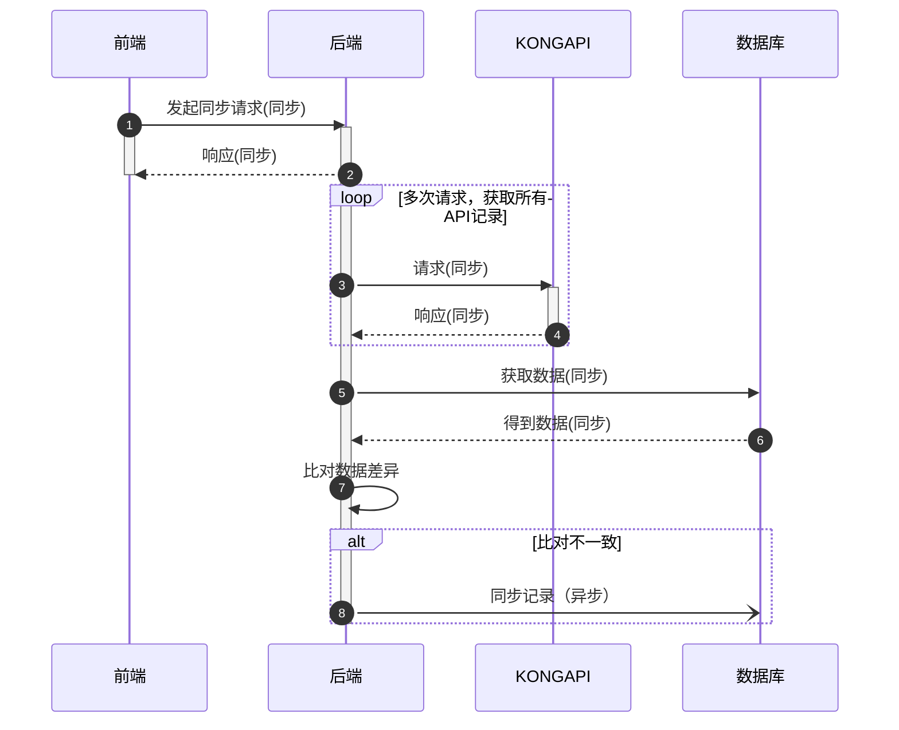
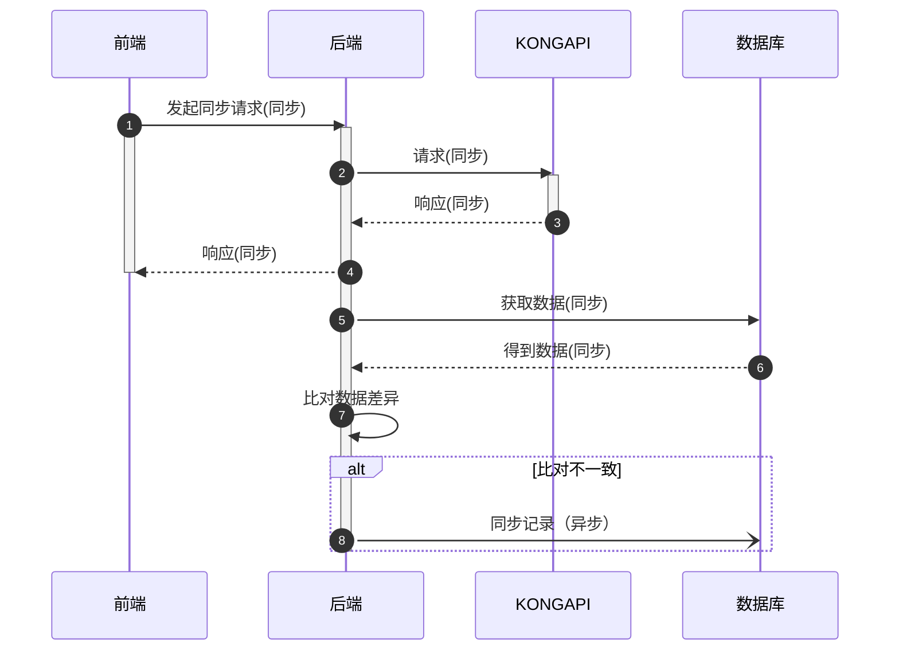
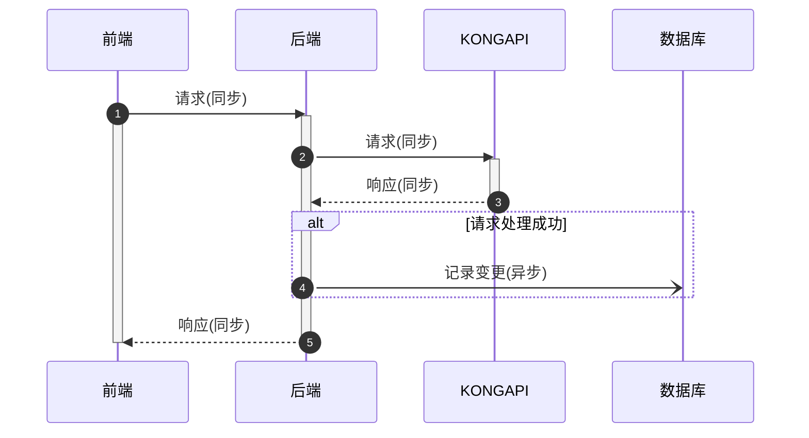

# KONG 模块设计

## 站点管理

简单的增删改查

## 路由管理

1. 同步：从指定站点同步路由数据到运维平台
2. 创建：新增路由
3. 修改：
4. 删除或释放

同步流程

```mermaid
sequenceDiagram
  participant 前端
  participant 后端
  participant KONGAPI
  participant 数据库
  autonumber
  前端->>后端: 发起同步请求(同步)
  activate 前端
  activate 后端
  后端-->>前端: 响应(同步)
  deactivate 前端
  loop 多次请求，获取所有API记录
    后端->>KONGAPI: 请求(同步)
    activate KONGAPI
    KONGAPI-->>后端: 响应(同步)
    deactivate KONGAPI
  end
  后端->>数据库: 获取数据(同步)
  数据库-->>后端: 得到数据(同步)
  后端->>后端: 比对数据差异
  alt 比对不一致
    后端-)数据库: 同步记录（异步）
  end

  deactivate 后端

```

获取流程

```mermaid
sequenceDiagram
  participant 前端
  participant 后端
  participant KONGAPI
  participant 数据库
  autonumber
  前端->>后端: 发起同步请求(同步)
  activate 前端
  activate 后端
  后端->>KONGAPI: 请求(同步)
  activate KONGAPI
  KONGAPI-->>后端: 响应(同步)
  deactivate KONGAPI
  后端-->>前端: 响应(同步)
  deactivate 前端
  后端->>数据库: 获取数据(同步)
  数据库-->>后端: 得到数据(同步)
  后端->>后端: 比对数据差异
  alt 比对不一致
    后端-)数据库: 同步记录（异步）
  end

  deactivate 后端

```

创建流程

创建或更新

```mermaid
sequenceDiagram
  participant 前端
  participant 后端
  participant KONGAPI
  participant 数据库
  autonumber
  前端->>后端: 请求(同步)
  activate 前端
  activate 后端
  后端->>KONGAPI: 请求(同步)
  activate KONGAPI
  KONGAPI-->>后端: 响应(同步)
  deactivate KONGAPI
  alt 请求处理成功
    后端-)数据库: 记录变更(异步)
  end
  后端-->>前端: 响应(同步)
  deactivate 后端
  deactivate 前端
```
