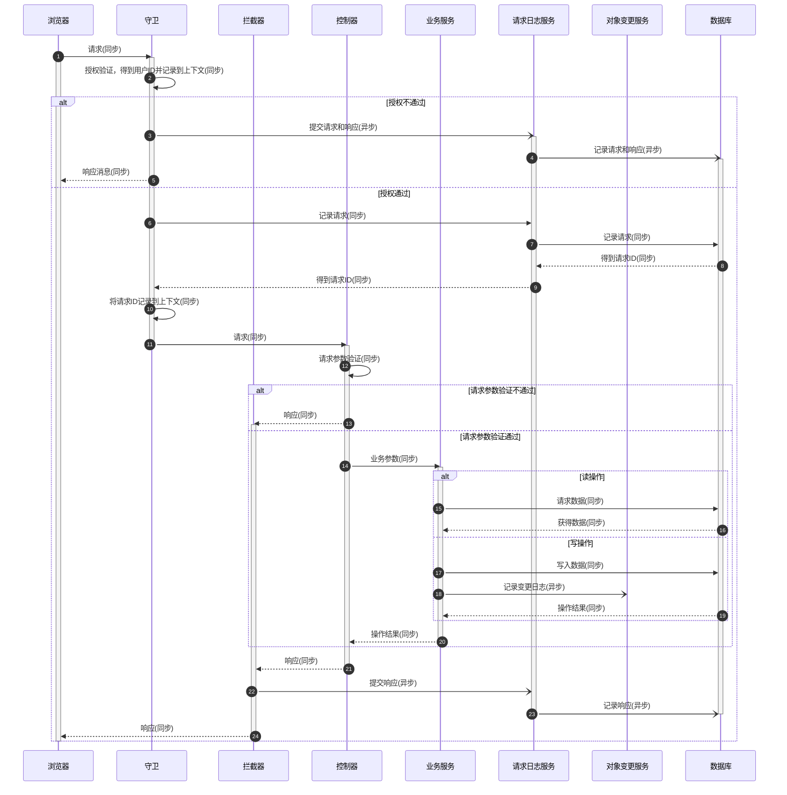

# 设计原则

## 代码尽量重用

- 使用面向切面编程模式，设计通用的路由守卫和拦截器
- 抽象通用的类和通用的方法

## 前后端交互

- 尽量减少前后端数据交互量
  - 数据列表请求接口增加版本标记，只返回版本标记变化后的数据
  - 规划返回数据格式的字段，只返回必要字段
- 尽量减少后端的处理压力
  - 后端不做返回数据的逻辑处理（排序，关联等）和格式转换，只将必要的数据返回给前端，由前端基于这些数据做页面渲染

## 请求同步处理

- 按需验证请求消息头中的令牌，如果验证不通过则抛出异常
  - 跟身份认证相关的操作在守卫中处理
- 根据请求路由验证令牌的有效性，如果验证不通过则抛出异常
  - 授权参数在控制器中配置
- 验证请求提交数据的有效性，如果验证不通过则抛出异常
  - 定义 DTO 对象，验证提交数据
- 处理提交数据，并确定处理结果
  - 在服务中处理提交数据
- 返回响应消息

## 请求异步处理

- 在处理数据完成后，按需触发事件，记录操作日志和对象变更日志

## 请求日志的记录

- 在全局路由守卫中，将请求数据保存到日志记录表中，并生成日志 ID
- 在全局路由守卫中
  - 如果请求权限验证不通过，则直接生成返回异常，并将请求信息和返回异常保存为请求日志
  - 如果请求权限验证通过，则将请求信息保存到日志表中，并将返回的日志 ID 保存到上下文中
- 在控制器中，将服务处理的响应结果保存到上下文中
- 在拦截器中，根据上下文中保存的日志 ID 和响应结果信息，更新日志记录。

## 实体对象日志的处理

- 如果请求是对实体对象的创建或修改，且操作成功，则需要记录实体对象日志。（如果操作如果不成功，则只记录请求日志）
- 获取对象操作的最新版本号（版本号全局唯一，即所有操作对象共用一个递增的版本号序列）
- 将对象操作的最新版本号保存到实体对象表中，并触发实体对象更新事件
- 配置实体对象更新事件处理逻辑，将最新的实体对象更新信息添加到实体对象日志表中

### 消息队列的作用

- 为了提交响应效率，对于在后端中一定使用且较少修改的数据直接加载到后端缓存中（相当于在后端内存中永久有效），如配置数据
  - 如果对这类数据进行修改，需要通过消息队列的方式，通知所有其他后端（后端多副本运行）刷新缓存
- 为了减少无效交互，对于在前端一定使用且较少修改的数据直接缓存在前端中（相当于在前端中永久有效，如前端配置，菜单，用户，角色等）
  - 如果对这类数据进行修改，需要通过通知所有后端，再由后端通过 WebSocket 方式通知所有前端这类数据出现了更新，然后前端调用相应的接口进行相关数据更新（不同的前端根据缓存数据的差异需要进行的刷新操作可能不同）

## 请求时序图

