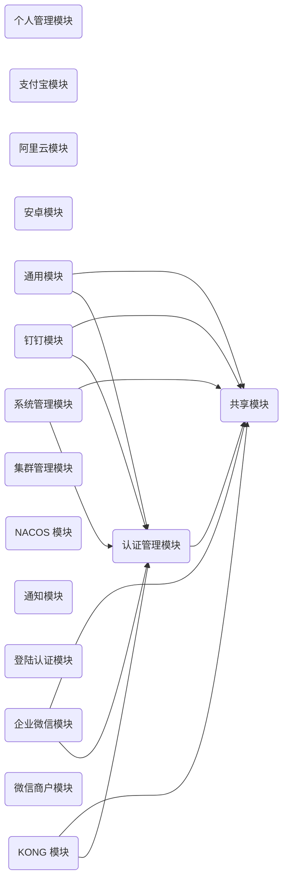

# 项目设计

注：按最细操作粒度的流程来设计，便于最终落地到运维管理平台上的操作细节。

## 模块及依赖关系

account：个人管理模块

alipay：支付宝模块

aliyun：阿里云模块

android：安卓模块

auth：认证管理模块

common：通用模块

dingtalk：钉钉模块

kong：KONG 模块

kubernetes：集群管理模块

nacos：NACOS 模块

notify：通知模块

passport：登陆认证模块

shared：共享模块

sys：系统管理模块

wechat：微信商户模块

wxwork：企业微信模块

